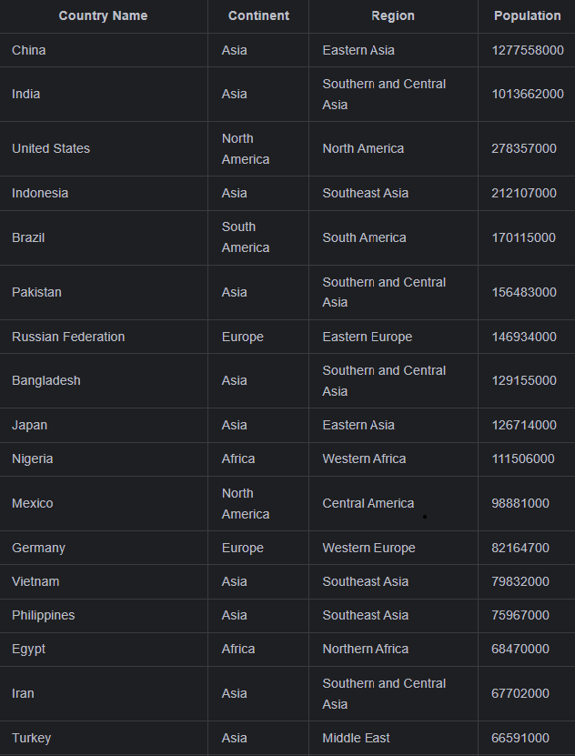

## Group Project Coursework for Software Engineering Methods  

## Master Build Status:  

## License: 

## Release: 

## Develop Build Status: 

## Code of Conduct:  
Collaborators will -
 
    * Commit to doing the best work possible
   
    * Equally share project workload
   
    * Treat each other with respect
   
    * Be open to new ideas
   
    * Communicate effectively when in need of help
   
    * Continuously test product code
   
    * Use ethical work practices:
   
      Refrain from the use of AI
     
      No plagiarism of other groups

# Requirements

| ID    | Name | Met  | Screenshot |
|-------|------|------|------------|
| 1     | All the countries in the world organised by largest population to smallest. | no | image |
| 2     | All the countries in a continent organised by largest population to smallest. | yes |   |
| 3     | All the countries in a region organised by largest population to smallest. | No |  |
| 4     | The top N populated countries in the world where N is provided by the user. | No | image |
| 5     | The top N populated countries in a continent where N is provided by the user. | No | image |
| 6     | The top N populated countries in a region where N is provided by the user. | No | image |
| 7     | All the cities in the world organised by largest population to smallest. | No | image |
| 8     | All the cities in a continent organised by largest population to smallest. | No | image |
| 9     | All the cities in a region organised by largest population to smallest. | No | image |
| 10    | All the cities in a country organised by largest population to smallest. | No | image |
| 11    | All the cities in a district organised by largest population to smallest. | No | image |
| 12    | The top N populated cities in the world where N is provided by the user. | No | image |
| 13    | The top N populated cities in a continent where N is provided by the user. | No | image |
| 14    | The top N populated cities in a region where N is provided by the user. | No | image |
| 15    | The top N populated cities in a country where N is provided by the user. | No | image |
| 16    | The top N populated cities in a district where N is provided by the user. | No | image |
| 17    | All the capital cities in the world organised by largest population to smallest. | No | image |
| 18    | All the capital cities in a continent organised by largest population to smallest. | No | image |
| 19    | All the capital cities in a region organised by largest to smallest. | No | image |
| 20    | The top N populated capital cities in the world where N is provided by the user.| No | image |
| 21    | The top N populated capital cities in a continent where N is provided by the user. | No | image |
| 22    | The top N populated capital cities in a region where N is provided by the user. | No | image |
| 23    | The population of people, people living in cities, and people not living in cities in each continent. | No | image |
| 24    | The population of people, people living in cities, and people not living in cities in each region. | No | image |
| 25    | The population of people, people living in cities, and people not living in cities in each country. | No | image |
| 26    | The population of the world. | No | image |
| 27    | The population of a continent. | No | image |
| 28    | The population of a region. | No | image |
| 29    | The population of a country. | No | image |
| 30    | The population of a district. | No | image |
| 31    | The population of a city. | No | image |
| 32    | provide the number of people who speak the following the following languages from greatest number to smallest, including the percentage of the world population:
|       |Chinese. | No | image |
|       |English. | No | image |
|       |Hindi. | No | image |
|       |Spanish. | No | image |
|       |Arabic. | No | image |
